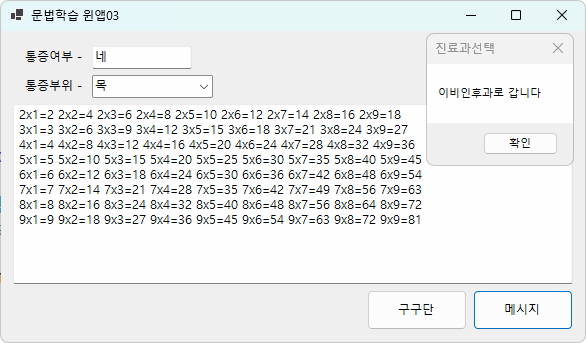
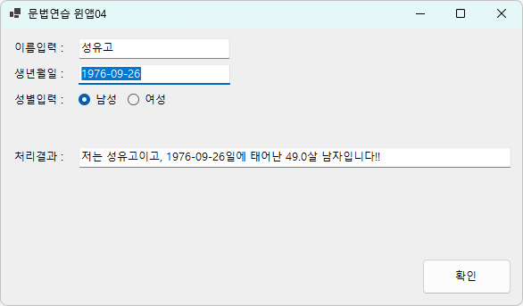
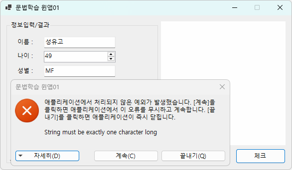
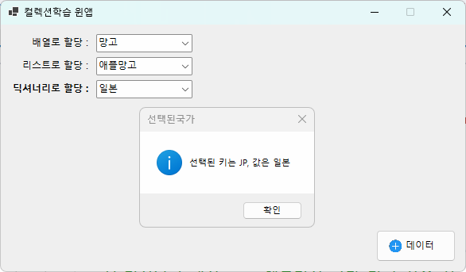
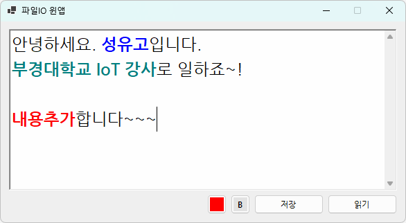
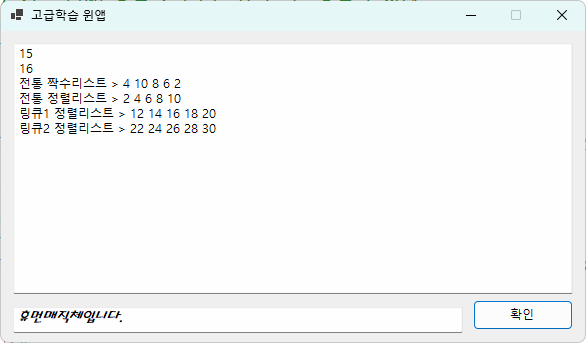
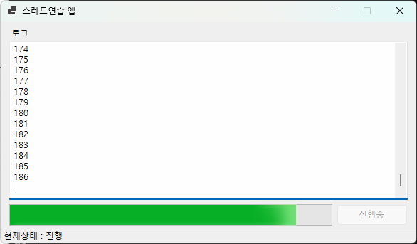

# iot-winapp-2025
Iot 개발자 C#/WinApp 리포지토리 2025

## 1일차

### C# 시작전에
- Visual Studio Installer 확인

    - `ASP.NET 및 웹 개발`, `.NET 데스크톱 개발` 필수
    - .NET Multi-Platform App UI 개발, 옵션

    

### C# 학습

## 흥미용 배경 공부

#### C# 이란?
- C#(씨샵) : **마이크로소프트**가 개발한 객체지향 프로그래밍 언어
    - 1990년, 귀도 반 로섬이 Python을 개발
    - 1985년, 비야네 스트롭스트룹이 C++을 개발(너무 어려움)
    - 1995년, 제임스 고슬링이 Java를 개발(C++의 문법을 기반, 좀 더 쉬운 언어, 1991년 개발 시작)
    - MS가 썬 마이크로시스템즈와 라이센스 채결 후 MS용 Java인 J++를 개발. 특허권 소송 발생
    - 1999년, 파스칼, 델파이를 개발한 `엔더스 헤일스버그`가 C++, Java를 기반으로 C#을 개발
    - 2000년, C# 발표
    - 2025년, C# 13.0

- C# 특징
    - 닷넷 플랫폼 위에서 동작(Managed C++, C#, Java, Python, ...)
    - 문법이 Java와 상당히 유사. C/C++ 언어 난이도가 낮음
    - Java와 달리 unsafe mode를 사용하면 C/C++ 포인터 기능을 사용 가능
    - 런타임 시 `쓰레기 수집(Garbage Collection)`으로 자동으로 메모리 관리

- C# 유머
    - 1999년 앤더스 헤일스버그가 최초 Cool(C-like Object Oriented Language)로 이름을 생성
    - C#의 의미는 C++보다 개선된 언어의 의미로 C++++, 또는 음악에서 #이 원래 음보다 반음 높음을 뜻

- C# 버전
    - C# 1.x - 2002년 ~ 2003년. 문제 많음.
    - C# 2.x - 2006년. 개선이 많이 됨.
    - C# 3.x - 2007년. Java와 차이가 많아짐
    - C# 4.x - 2010년. C#의 기반
    - ...
    - C# 6.x - 2015년. .NET Framework 4.6, .NET Core 1.x(리눅스)
    - C# 7.x - 2017~2018년. .NET Framework 4.7
    - ...
    - C# 9.0 - 2020년, `.NET 5.0`(Framework, Core 통합)
    - C# 10.0 - 2021년, .NET 6(소수점 삭제)
    - C# 11.0 - 2022년, .NET 7 
    - C# 12.x - 2023년, .NET 8
    - C# 13.x - 2024년 11월, .NET 9 (Visual Studio 2022에서 동작)

- 호환성, 범용성
    - Windows OS에서만 동작, OS플랫폼 독립적인 Java보다 범용성이 낮았음
    - 2016년부터 리눅스 공식 지원. macOS에서도 사용 가능. 오픈소스 공표
    - 유니티 엔진 기본언어, Xamarin(이후 MAUI로 변경)로 모바일 개발 가능
    - 리눅스 Mono라는 닷넷 개발 프로젝트 -> 후에 MS에 흡수됨

#### .NET Framework(.NET)
- `CLR(Common Langauage Runtime)` 클래스를 사용하는 가상 머신. 예로 C#과 Java로 동시에 개발 가능
- Java의 JVM과 유사한 개념
- 언어가 발전하면서 필요한 기능이 늘기 때문에 .NET Framework도 버전업을 계속함
- 2016년 리눅스 지원시부터 .NET Framework가 너무 윈도우 구조에 너무 토착되다보니 새로운 프레임워크가 필요함
- .NET Core - 리눅스 지원용 만든 .NET [Framework]
- .NET Core와 .NET Framework 가 혼용
- 2020년 .Net Core와 .Net Framework를 통합해서 .NET 5.0 공표. 이 이후부터 Framework. Core 이름 사라짐
- C# 버전과 .NET 버전 숫자 차이나기 시작

- .NET 데스크톱 개발을 설치하면 C#, Visual Basic, F# 등 여러언어를 사용가능

- `C# 12.0`, `.NET 8`, `Visual Studio 2022` Community Edition에서 학습

## 요약 정리

###  Visual Studio 설치 시 확인 사항

- 반드시 설치해야 할 워크로드:
  - [✔] **.NET 데스크톱 개발**
  - [✔] **ASP.NET 및 웹 개발**
- 선택 옵션:
  - [. ] **.NET Multi-platform App UI 개발 (MAUI)** → 모바일/크로스플랫폼 개발용

> 설치 후 콘솔 앱 생성 시 "콘솔 앱 (.NET)" 선택 권장  
> "콘솔 앱 (.NET Framework)"는 과거용이며 최신 기능 제한 있음

---

### ✅ C#이란?

- Microsoft에서 개발한 객체지향 언어 (2000년 발표)
- Java와 문법 유사, .NET 플랫폼 기반
- 자동 메모리 관리 (`GC`), 클래스 중심 설계
- Unity, MAUI, Windows 앱 개발 등 다양하게 활용 가능

---

### ✅ C# & .NET 버전 요약

| C# 버전 | 연도 | 대응 .NET | 비고 |
|---------|------|-----------|------|
| C# 6~7  | 2015~2018 | .NET Framework 4.6~4.7 | |
| C# 9    | 2020 | .NET 5.0 | Core/Framework 통합 |
| C# 10   | 2021 | .NET 6.0 | 버전 단일화 시작 |
| C# 11   | 2022 | .NET 7.0 | |
| C# 12   | 2023 | .NET 8.0 | 현재 기준 최신 |
| C# 13   | 2024(예정) | .NET 9.0 | VS 2022 지원 예정 |

---

### ✅ .NET 정리

- .NET은 CLR(Common Language Runtime) 기반 실행 환경
- 원래 Windows 전용 `.NET Framework` → 이후 리눅스도 지원하는 `.NET Core` 등장
- **2020년 `.NET 5.0`부터 통합**되어 `.NET Core`, `.NET Framework` 구분 사라짐

## 2일차
- WinApp으로 문법 학습. 문법 학습 후 WPF로 이전

### 새 프로젝트(콘솔) 만들기
- 순서
    1. 프로젝트 마법사
        - 언어 : C#
        - 플랫폼 : 모든 플랫폼
        - 프로젝트 : 콘솔 선택 (데스크톱, 웹, 콘솔)
    2. 새 프로젝트 구성
        - 프로젝트 이름, 위치, 솔루션 이름
        - 솔루션 및 프로젝트를 같은 디렉토리에 배치 체크박스 해제 : 솔루션 내에 여러 프로젝트를 관리
    3. 추가 정보
        - 프레임워크 : .Net 8.0 선택
        - LTS(Long Term Support) : 개발자가 기능, 보안 업데이트를 지원
        - 최상위 문 사용 안함 체크박스 선택

### 새 프로젝트 (테스크톱, 윈앱) 만들기
- 아직 멀티플랫폼은 지원 안됨(Windows만 지원)
- Windows Forms : 가장 오래된 윈앱 개발
- WPF : 좀 더 디자인적으로 뛰어난 윈앱 개발
- 순서
    1. 프로젝트 마법사
        - 언어 : C#
        - 플랫폼 : 모든 플랫폼
        - 프로젝트 : 데스크톱 선택
    2. Windows Forms 앱 선택 (.NET Framework가 안 적힌 것)
    3. 프로젝트 명 입력
    4. 추가 정보
        - 프레임워크 : .NET 8.0 (장기지원) 선택

- 프로젝트 구조
    - 종속성 : 필요모듈 추가, 관리, 삭제
    - Form1.cs : 윈폼 앱 개발 로직
        - Form1.Desiner.cs : 실제 디자인 소스
        - Form1.resx : 아이콘, 이미지, 리소스문자열 관리 파일
    - Program.cs : 시작 프로그램 소스. 지우면 안됨

### 솔루션 관리
- 하나의 솔루션에 여러개 프로젝트가 있으면 시작 프로젝트가 선별되어야 함
- 굵은 글씨체로 나오는 프로젝트가 시작 프로젝트
    1. 시작 프로젝트로 변경할 프로젝트 > 마우스 오른쪽 > 시작 프로젝트로 설정
    2. 전체 솔루션 > 속성 > 속성 페이지
        - 시작 프로젝트 구성 메뉴 > 현재 선택 영역 선택 

- 전체 솔루션 : *.sin(전체 솔루션 관리)
    - 프로젝트파일(C#) : *.csproj
    - 프로젝트파일(CPP) : *.vcxproj

- debug/release 모드
    - debug : 개발시 사용모드, 디버깅 로그, 디버깅을 위주
    - release : 배포시 사용모드. 프로그램 최적화, 성능 업. 릴리즈로 하면 디버깅이 안되는 경우가 예전엔 있었다.

### 윈폼 앱/ 윈앱 개발 순서

1. Form1.cs 이름 변경 : FrmMain.cs
    - 변경 시 `모든 참조 이름도 바꾸시겠습니까?` 메시지 창
        - 반드시 `예` 선택
2. FrmMain.cs [디자인] 클릭 오픈
    - 마우스로 크기 조정
3. 속성 창(F4) 오픈, 솔루션 탐색기 아래쪽 드래그 후 붙이기
4. PyQt Designer와 거의 유사
    - FrmMain 속성 창 > Text > Form1 글자를 변경 후 엔터
    - size 속성 > Width, Height를 직접 수정
    - StartPosition > CenterScreen으로 변경
    - MaximizeBox > False
    - FormBorderStyle > Sizable -> FixedSingle로 변경
5. 보기 > 도구 상자 클릭
    - 공용 컨트롤 > Button 드래그
    - 더블클릭, 클릭으로 선택 후 폼에서 왼쪽버튼 누르고 드래그 등 다양

6. 속성 창 - 드롭다운 컨트롤 클릭 > 여러 클래스 리스트

7. button1 속성 변경
    - (Name) > button 1 -> BtnMsg 로 변경
    - Size 조정
    - Text > button1 > 메시지 로 변경

8. 중간마다 Ctrl + S(저장), Ctrl+Shift+S(모두 저장) 눌러서 저장 습관

9. 속성 창의 이벤트아이콘(번개표시) 클릭
    - Click에 선택 되어 있음
    - 버튼의 경우, 버튼클릭이 기본 이벤트
    - Click 오른쪽 빈공간을 더블클릭
    - 버튼을 클릭했을 시 처리할 이벤트 메서드가 자동 생성

10. 새로 만든 컨트롤을 더블 클릭
    - 이벤트 메서드가 자동 생성
    - 최초에 아무런 이벤트가 없을 때 더블클릭 시 기본 이벤트 메서드 생성

11. 오류 발생 시
    - 폼 디자인의 컨트롤 이벤트와 로직 코드 상의 이벤트 처리 메서드 생성 상 불일치로 발생
    - 이벤트 이름은 생성되고, 이벤트 정의 메서드는 생성이 안 돼서

    

    - FrmMain.Designer.cs 파일 오픈 
    - Windows From Designer generated code를 확장
    - 오류난 이벤트 이름 삭제
        - BtnMsg.Click += .....
        - BtnOk.Click += ...

12. MessageBox.Show() 작업
    - MessageBoxIcon.Warning, MessageBoxIcon.Error 사용시 알람 사운드 발생
    알람 사운드 발생

13. 폼 디자이너 화면과 코드 상 전환
    - F7(코드 보기), Shift+F7(디자인 전환)

14. VS에서 더블클릭 함부로 하지 말것!!!
    - 이벤트 메서드 생성, 컨트롤 자동 생성, 폼 디자인 표시 등에서만 사용

15. 두 개 이상의 컨트롤 선택 후 Ctrl키 누른 상태에서 드래그하면 그룹으로 복사 

### 윈앱 컨트롤1
- `Button` : 클릭을 위한 컨트롤
    - 보통 Btn~ 으로 시작
    - `(Name)` : 소스코드상에서 접근, 사용
    - Enabled : 사용여부
    - Location : 폼상의 위치 (x, y)
    - Size : 버튼 크기 (w, h)
    - TavIndex : 실행 후 탭으로 포커스가 가는 순서 (레이블에는 포커스 안감)
    - Text : 버튼 표시 글씨
    - Visible : 화면 표시 여부
    - **Click** : 버튼 클릭 이벤트 처리 메서드 연결

- `Label` : 화면 상의 글자만 표현하는 컨트롤
    - 보통 Lbl~ 로 시작
    - Button 컨트롤과 동일
    - 이벤트 거의 사용하지 않음

- `TextBox` : 텍스트 입력을 위한 컨트롤
    - 보통 Txt~ 로 시작
    - Button 컨트롤과 동일
    - BorderStyle : 컨트롤 테두리 설정
        - None : 테두리 없음
        - FixedSingle : 검은색 테두리
        - Fixed3D : 입체감 있는 테두리
    - MaxLength : 최대 몇자까지 적을 수 있는지
    - Multiline : 여러줄 사용 여부. true가 되어야 높이 조절 가능
    - PlaceholderText : 입력전 입력내용 표시
    - ReadOnly : 입력가능 여부, true는 입력불가
    - **TextChanged** : 글자가 변경되면 발생하는 이벤트
    - **KeyPress** : 키보드 입력이 생기면 발생하는 이벤트

- `ComboBox` : 여러개 중 아이템을 선택하는 컨트롤
    - 보통 Cbo~ 로 시작
    - Button 컨트롤과 속성은 동일
    - Items(Collection) : 필요한 아이템 할당
    - **SelectionIndexChanged** : 선택한 아이템 순번이 바뀔때 발생하는 이벤트
    - **SelectedValueChanged** : 선택한 아이템 값이 바뀔때 발생하는 이벤트

- `RadioButton` : 여러개중 하나만 선택하는 컨트롤
    - 보통 Rdo~ 로 시작
    - Button 컨트롤과 속성은 동일
    - Checked : 체크 여부

### C# 문법
- 기본 문법 - C++, Java와 거의 동일. C++와의 차이점만 비교.
    1. 기본구조 및 주석 - [소스](./day02/DayConsole2/ConsoleApp1/Program.cs)
        - 네임스페이스, 클래스, 메서드

        ```cs
        namespace ConsoleApp2
        {
            /// <summary>
            /// 프로그램 클래스
            /// </summary>
            internal class Program
            {
                    /// <summary>
                    /// 주석 - XML 주석. 소스코드 자동 문서 생성시 사용.
                    /// </summary>
                    /// <param name="args"></param>
                static void Main(string[] args)
                {
                    // 주석 - 한 줄 주석
                    Console.WriteLine("Hello, World!");
                    /*
                    * 주석 - 여러 줄 주석
                    * 여러 줄을 작성할 때 편리
                    */
                }
            }
        }
        ```
    2. 자료형과 변수, Nullable - [소스](./day02/DayConsole2/SyntaxWinapp01/FrmMain.cs)
        - 변수 사용은 C++과 동일
        - 자료형도 C++ 유사, 클래스형은 차이있음. 닷넷타입이 더 추가됨. (공통 타입을 더 쓰기 위해서 추가된 부분)
        - 닷넷타입은 여러 언어에서 공통으로 사용위해서 추가된 기능
        - Nullable : 특수타입 데이터 타입 뒤에 ? 추가. Null 할당 가능
        - var타입 : 지역변수에서 타입을 동적으로 지정. 컴파일시 해당 타이으로 자동 지정
            - 지역변수만 가능(전역변수 사용불가)
            - 한번 타입이 지정되면 다른 타입으로 변경불가
        
    3. 연산자 - [소스](./day02/DayConsole2/SyntaxWinapp02/FrmMain.cs)
        - C, C++ 과 동일!

    4. 분기문, 반복문 - [소스](./day02/DayConsole2/SyntaxWinApp03/Form1.cs)
        - if문
        - switch문
        - for문
        - for each는 컬렉션에서...
        - while문

        


## 2일차 핵심 요약 (WinForms + C# 문법)

### WinForms 프로젝트 생성 및 구조 이해

#### 새 프로젝트 생성 절차
- 콘솔 앱
  1. 프로젝트 마법사에서 콘솔 선택 (C#, 모든 플랫폼)
  2. 프로젝트 이름, 위치 설정
  3. .NET 8.0 (LTS) 선택, "최상위 문 사용 안함" 체크

- Windows Forms 앱 (윈앱)
  1. 프로젝트 마법사 > C# + 데스크톱 > Windows Forms 앱 (.NET Framework 미포함 버전 선택)
  2. .NET 8.0 (LTS) 선택

#### 프로젝트 구성 요소
| 파일명 | 역할 |
|--------|------|
| Form1.cs | 폼 로직 (사용자 코드) |
| Form1.Designer.cs | 폼 디자인 소스 (자동 생성) |
| Form1.resx | 리소스 (아이콘, 문자열 등) |
| Program.cs | 진입점, 삭제하면 안 됨 |

### 기본 설정 및 실무 설정

#### 솔루션 관리
- 하나의 솔루션에 여러 프로젝트 가능 → 시작 프로젝트 지정 필요
- 설정 방법:
  - 솔루션 탐색기 > 프로젝트 우클릭 > "시작 프로젝트로 설정"
  - 또는 솔루션 우클릭 > 속성 > 시작 프로젝트 구성 메뉴 이용

#### Debug / Release 모드
| 모드 | 설명 |
|------|------|
| Debug | 개발 중, 디버깅 정보 포함 |
| Release | 배포용, 성능 최적화됨 (디버깅 불가) |

#### 폼 설정
- FormBorderStyle = FixedSingle : 창 크기 고정
- MaximizeBox = false : 최대화 버튼 제거
- StartPosition = CenterScreen : 화면 중앙 정렬

#### 디자인과 코드 전환 단축키
- 디자인 보기: Shift + F7
- 코드 보기: F7

### 폼 컨트롤 구성

#### Button
- 클릭용, 보통 이름은 Btn~
- 주요 속성: (Name), Text, Size, Enabled, Visible, Click 이벤트

#### Label
- 텍스트 출력용, 이름은 Lbl~

#### TextBox
- 텍스트 입력용, 이름은 Txt~
- 주요 속성: MaxLength, Multiline, PlaceholderText
- 주요 이벤트: TextChanged, KeyPress

#### ComboBox
- 항목 선택용 드롭다운, 이름은 Cbo~
- 주요 속성: Items, SelectedIndex, SelectedItem
- 이벤트: SelectedIndexChanged, SelectedValueChanged

#### RadioButton
- 여러 개 중 하나만 선택, 이름은 Rdo~
- 속성: Checked

### 문법 정리

#### Nullable 타입
```csharp
int? score = null;
if (score != null)
{
    Console.WriteLine(score.Value);
}
```

#### var 타입
```csharp
var name = "홍길동";
```
- 지역 변수 전용, 타입 고정됨

#### 연산자
- C, C++와 동일 (=, +, -, *, /, %, &&, ||, ^, &, |, ! 등)

#### 조건문과 반복문
- if, switch, for, foreach, while, do while

### 추가 학습
- SelectedValue는 데이터 바인딩된 ComboBox에서만 값이 있음
- KeyPress는 문자 키만 감지, KeyDown은 모든 키 감지
- 폼 설정 시 FormBorderStyle, MaximizeBox, StartPosition을 조합해서 사용
- Nullable은 입력이 비어 있을 수 있는 상황을 처리할 때 유용함
- 이벤트 자동 생성(더블클릭)은 필요한 경우에만 사용

## 3일차

### Visual Studio Tip
- 가장 많이 사용할 단축키 : Alt + Enter

### 한글 문제
- 한글 깨지는 문제
    - 콘솔 > Program.cs : UTF8 BOM 저장
    - 윈앱 > FrmMain.cs : EUC-KR(CP949) -> 깃허브에서 한글이 깨져서 나옴

- 각 IDE별 한글 깨짐 해결 방법
    - VS Code > 오른쪽 하단 상태표시줄 UTF-8 클릭 인코딩 하여 다시 열기 또는 인코딩하여 저장 실행
    - VS > 다른 이름으로 저장 > 인코딩하여 저장 > UTF-8 선택 저장

### 윈앱 컨트롤2
- 모든 컨트롤은 `Control` 클래스를 상속
- `MaskedTextBox`: 사용자에게 주어진 형태로만 입력을 하도록 강제하는 텍스트 입력 컨트롤
    - 텍스트박스와 동일하게 Txt~ 로 시작
    - Button 컨트롤과 속성 동일
    - Mask : 사용자에게 입력 제약할 포맷

- `GroupBox` : 관련있는 컨트롤들을 묶어주는 컨트롤
    - 이름을 절대 바꾸지 않음 (0.1% 정도만)
    - Button 컨트롤과 속성 동일
    - Text 속성만 사용

- Button 이미지 추가
    1. 각 폼별 리소스 사용
        - 속성 Image : ... 버튼
        - 리소스 선택 > 로컬 리소스 > 가져오기
        - FrmMain.resx에 저장
    2. 폼 위에 ImageLists 컨트롤 사용
        - 도구 상자 ImageLisst 컨트롤 드래그
        - 폼에 표현되는 컨트롤 아님
    3. 전체 리소스에 추가
        - Properties > Resources.resx
        - 속성 Image : ... 버튼
        - 리소스 선택 > 프로젝트 리소스 파일 > 가져오기
    4. Padding 속성
        - Left : 10 정도 지정
    5. 솔루션 탐색기 > 새 폴더
        - Resources 생성

- `PictureBox` : 이미지를 표현해주는 컨트롤
    - Pic~ 시작, Pbx~
    - BorderStyle : FixedSingle로 실선
    - BackColor : 폼색과 다르게 해서 영역표시
    - Image : 표시할 이미지 선택
    - Size : 크기
    - SizeMode : 들어가는 이미지 사이즈형태
        - Normal : 큰 이미지는 잘려서 나옴
        - StretchImage : 픽쳐박스 크기에 맞춰서 표시
        - AutoSize : 자동 사이즈
        - CenterImage : 작은 이미지를 중앙에 표시
        - Zoom : 확대 표시
    - 들어갈 이미지의 속성
        - 출력 디렉토리로 복사 : 항상 복사

### 윈앱 개발기능
- Debug - 디버깅시 필요한 기능 담은 클래스
    - Debug.WriteLine() : 디버그 > 창 > `출력`에 디버깅 로그 출력
    - 디버깅 시작으로 실행 시에만 출력
- 프로젝트 속성
    - 출력 유형 : Win 애플리케이션 > 콘솔 애플리케이션으로 변경
    - Console.WriteLine() 사용

### C# 문법

- 기본 문법

    6. 문자열 처리 - [소스](./day02/DayConsole2/SyntaxWinApp04/Form1.cs)
        - 콘솔에서 입력되는 값 -> 모두 문자열
        - 윈앱에서 TextBox에서 입력되는 값 -> 모두 문자열

        

    7. 클래스와 객체, 메서드, 속성 - [소스](./day03/Day03Study/SyntaxWinApp01/Person.cs)
        - 객체를 생성하는 틀
        - 명사(멤버변수, 속성), 동사(멤버 메서드)
        - Get/Set
    8. 접근제어자
        - `private` : 클래스 내에서만 사용 가능
        - `public` : 어디서나 접근 가능
        - protected : 내부, 자식 클래스에서만 접근 가능
        - `internal` : 동일한 네임스페이스에서 public
        - internal protected : 동일한 네임스페이스에서 protected 기능
        - internal은 최근에 자동생성에서 자주 사용되고 있음

        

    9. 상속, 다형성, 추상클래스, 인터페이스 - [소스](./day03/Day03Study/SyntaxWinApp02/Computer.cs)
        - Java는 한 파일당 하나의 클래스 선호
        - C#은 한 파일에 클래스 여러개 생성해도 무방
        - 상속
            - 부모클래스에 자식객체 할당 가능
        - sealed : 더이상 상속을 하고 싶지 않을 때
        - is, as : 객체 타입을 비교, 형번환 키워드
        - System.Object : 모든 클래스의 조상
        - this : 클래스 자신. 현재는 사용 권장 안함
        - base : 부모클래스 지칭. 현재는 사용 권장 안함
        - 다형성 오버라이드 : 부모 메서드를 재정의
            - 추상 : 대략적인 틀만 가지고 있음
            - 이름과는 다르게 실행할 수 있는 능력 부여
            - 부모메서드는 virtual(추상) 키워드
            - 자식메서드는 override 키워드
        - 다형성 오버로드 : 같은 메서드를 여러번 사용
            - 파라미터 형태와 갯수에 따라 무한대로 같은 이름의 메서드를 생성가능
        - 인터페이스 : 계약관계 정의하고 구현없이 선언만 포함한 클래스의 일종
            - 추상클래스 개선한 방법
            - 추상클래스는 구현을 가질 필요가 없이 하위에서 상속된 자식클래스가 다시 구현하면 됨
            - 문제는 추상클래스도 구현을 가지고 있어서, 이해도가 떨어짐
            - 다중 상속을 방지하기 위해서 인터페이스 사용
            - I인터페이스명 형태로 명명
            - 내부 메서드만 존재. 형태만 구성(구현X)
            - 인터페이스는 직접 코딩하지말 것.
            - Alt+Enter > 인터페이스 구현 선택
            - 인터페이스는 사용 개수에 제약 없음. 다중구현 대체
        
        
        - 얕은 복사, 깊은 복사
            - 얕은 복사 : 내부를 같이 참조하는 형태
            - 깊은 복사 : 완전히 새로 객체 생성

        

## 4일차 수업 정리

---

## 1. WinForm 컨트롤

### 1-1. NumericUpDown (숫자 전용 입력 컨트롤)

- 숫자 전용 입력을 위해 사용하는 컨트롤
- `Nud` 접두어로 이름을 붙임
- 나머지는 Button과 같음

| 속성 | 설명 |
|------|------|
| Minimum | 입력 가능한 최소값을 설정함 |
| Maximum | 입력 가능한 최대값을 설정함 |
| Value | 현재 선택된 값을 나타냄 |
| 이벤트 | 일반적으로 이벤트는 거의 생성하지 않음 |

### 1-2. 대부분의 컨트롤 공통 속성

| 속성 | 설명 |
|------|------|
| Anchor | 폼 크기 조절 시 컨트롤을 어느 방향에 고정할지 설정함<br> - 왼쪽 상단: Left, Top<br> - 오른쪽 하단: Right, Bottom |
| Dock | 컨트롤을 폼이나 컨테이너의 특정 방향에 도킹함<br> - Top, Left, Right, Bottom, Fill<br> - 보통 `Panel`, `GroupBox` 같은 컨테이너 안에서 사용함 |
| Anchor + Dock 병행 사용 | 폼 크기가 바뀔 때 위치 고정과 리사이징을 동시에 처리할 수 있음 |
| Font | `대표적인 폰트` 사용할 것 (폼에서 변경 시 하위 컨트롤 같이 변경) |

> Anchor는 위치 고정, Dock은 공간 채우기로 이해하면 됨

### 1-3. RichTextBox (포맷팅이 가능한 텍스트 박스)

- MS Word, 한글 워드 프로세서 같은 문장 꾸미기, 페이지 꾸미기가 가능
- `Rtb` 접두어로 이름을 붙임

| 속성 | 설명 | 비고 |
|------|------|------|
| ScrollBars | 컨트롤 오른쪽, 하단에 스크롤바 생성 | Both보다는 ForcedBoth, ForcedVertical사용
| WordWrap | 컨트롤 길이를 넘어가면 자동으로 줄바꿈 여부 |  |

### 1-4. OpenFileDialog

- 읽을 파일 위치와 파일을 선정하는 다이얼로그 창 컨트롤
- 폼 위에 표시되지 않는 컨트롤
- `DlgOpen`로 이름을 붙임
- 코딩으로 설정 내용 작성


### 1-5. SaveFileDialog

- 저장위치에 파일명 지정하는 다이얼로그 창 컨트롤
- 폼 위에 표시되지 않는 컨트롤
- `DlgSave`로 이름을 붙임
- 코딩으로 설정 내용 작성

### 1-6. ColorDialog

- `DlgColor`로 이름을 붙임

---

## 2. Visual Studio 팁

- **Code Snippet(코드 조각)** 기능을 활용하면 좋음  
  → 자주 쓰는 구문을 자동으로 불러올 수 있음  
  → 오타를 줄이고 생산성을 높일 수 있음

- 보기 > 개체 브라우저에서 필요한 클래스 검색
- 소스코드에서 회색으로 연하게 변하는 것 > 되도록이면 사용을 피하라는 뜻 > Alt+Enter로 변경권장사항 확인

---

## 3. C# 문법(++): 형변환 (Type Conversion)

### 3-1. 묵시적 형변환 (자동 변환)

- 작은 자료형에서 큰 자료형으로 자동 변환됨
- 예: `int → long`, `float → double`
- 데이터 손실이 없기 때문에 자동으로 처리됨

### 3-2. 명시적 형변환 (강제 변환)

- 큰 자료형에서 작은 자료형으로 바꿀 때 `(자료형)`을 명시해야 함
- 예: `(int)3.14`, `(float)100L`
- 오버 플로우 주의
- 컴파일은 되지만, 실행 중 문제는 개발자 책임

### 3-3. 문자열 → 숫자형 변환

- 문자열을 숫자 타입으로 바꾸려면 `Parse()` 또는 `TryParse()`를 사용함

```csharp
int.Parse("123");      // 성공 시 정수로 변환됨
int.Parse("abc");      // 실패 시 FormatException 발생함
```

- `TryParse()`는 예외 없이 true/false로 결과를 알려주고, 가장 안전함

```csharp
int result;
bool success = int.TryParse("123", out result);
```

### 3-4. Convert 클래스 사용

- 문자열을 정수, 실수 등 다양한 타입으로 바꿀 수 있음
- `null`이 들어오면 예외 대신 기본값(예: 0)을 반환함
- 상대적으로 안전함

```csharp
Convert.ToInt32("123");   // 123 반환함
Convert.ToInt32(null);     // 0 반환함
```

### 3-5. Parse vs Convert 비교

| 항목 | int.Parse() | Convert.ToInt32() |
|------|-------------|------------------|
| null 입력 | 예외 발생함 | 0 반환함 |
| 지원 타입 | 문자열만 가능함 | 다양한 타입을 지원함 |
| 예외 발생 위험 | 상대적으로 높음 | 낮음 |

---

## C# 문법 : 10. 예외 처리 (Exception Handling)


https://github.com/user-attachments/assets/322bfd4a-f7ba-4e33-81c3-55ec3fedb0c0


### 10-1. 목적

- 프로그램 실행 중 예상하지 못한 오류로 인한 비정상 종료를 막기 위함
- 예외가 발생했을 때 사용자에게 알리고, 프로그램이 멈추지 않도록 처리함

### 10-2. 구문 구조

```csharp
try {
    // 예외 발생 가능성이 있는 코드
}
catch (Exception ex) {
    Console.WriteLine(ex.Message);
}
finally {
    // 예외 발생 여부와 관계없이 항상 실행됨 (자원 정리 등)
}
```

### 10-3. 특징 정리

| 항목 | 설명 |
|------|------|
| try | 예외가 발생할 수 있는 코드 영역을 정의함 |
| catch | 예외가 발생했을 때 실행되는 블록 (예외 종류별로 따로 처리 가능함) |
| finally | 예외와 상관없이 항상 실행되는 블록 (생략 가능함) |
| Exception 클래스 | 모든 예외 클래스의 부모 클래스임 |
| 예외 타입 모를 때 | Exception으로 통합 처리 가능함 |

### 10-4. 실무 팁

- 파일 입출력, DB 연결, 네트워크 통신 등은 예외가 자주 발생하므로 반드시 try-catch를 써야 함
- 사용자에게는 구체적이고 이해 가능한 메시지를 보여주는 게 좋음
- 자원 정리는 `finally` 블록이나 `using`문으로 처리함
- 예외는 가능한 한 구체적인 예외 클래스로 나누어 처리하는 것이 좋음 (예: `FileNotFoundException` 등)

### 10-5. 요약 정리

- 예외 처리는 프로그램 실행 중 문제가 생겨도 프로그램을 죽이지 않고 흐름을 이어가게 해주는 안전장치임
- 예외는 피할 수 없지만, 미리 대비하는 구조를 만드는 것이 중요함



### 11. 컬렉션 - [소스](./day04/Day04Study/SyntaxWinApp02/FrmMain.cs)
- 배열 리스트, 딕셔너리, 큐, 스택 등 여러 데이터를 저장하고 다루는 구조를 가진 객체를 총칭

    - 배열로 콤보박스에 데이터 할당
    - 리스트로 콤보박스 데이터 할당
    - 딕셔너리로 콤보박스 데이터 할당



### 12. 파일입출력
- 파일 쓰기, 읽기 기능
- SaveFileDialog, OpenFileDialog, ColorDialog 컨트롤 사용



## 5일차

### C# 문법

- [공통 수업 정리] 기본 문법 
    
    13. 델리게이트, 이벤트 - [소스](./day05/Day05Study/SyntaxWinApp01/FrmMain.cs)
        - **대리자** : 메서드를 변수처럼 저장하고 호출할 수 있는 타입
            - C++/Java 함수포인터, 파이썬 콜백함수
        - 대리자는 실행 메서드를 들고 있고, 대리자를 호출하면 대리자가 메서드를 대신 호출
        - 대리자는 호출할 메서드와 파라미터가 일치
        - 윈폼에서 버튼을 클릭하면, 직접 메서드를 호출하는 게 아니고, C#이 사용자의 움직임을 체크하고 있다가 클릭 `이벤트가 발생하면 그에 해당하는 메서드를 대신 실행(호출)`
        
        - 대리자의 장점
            - 메서드를 변수처럼 저장
            - 런타임 시 메서드를 바꿀 수 있음
            - 하나의 대리자가 여러개의 메서드를 호출할 수 있음

        - Action, Func, Predicate
            - 대리자 생략형 // 잘 몰라도 됨.

        - **이벤트** : 대리자의 특별한 형태. 어떤 일이 발생하면 연결된 메서드를 호출하는 것, PyQt의 `시그널`과 동일
            - 윈앱 버튼 클릭, 마우스 드래그, 타이머 종료
            - 모바일, 윈앱, 웹앱 개발 모두 이벤트 덩어리 집합
        
        - 메서드 -> 대리자 -> 이벤트 -> 사용자가 연결해서 동작시킴
        - delegate : 메서드를 저장하고 실행하는 타입
        - event : delegate에게 '무슨 일이 발생하면 실행해!'라고 해주는 역할
        - +=, -= : 이벤트 구독(이벤트핸들러 연결), 이벤트 구독 해제

        - 자주 쓰이는 이벤트
            - Form_Load - 아래에 설명
            - Button_Click - 생략
            - TextBox_KeyPress - 생략
            - Combobox_SelectedIndexChanged - 생략
        
        - Form 오픈 이벤트 및 생성자
            1. FrmMain 생성자 : 클래스 생성자
                - InitializeComponent() 객체(컨트롤)변수 초기화
            2. `FrmMain_Load` 이벤트 : 폼이 로드(메모리 업)될때 처리할 내용
                - 생성자 이외에 초기화할 것
                - 폼 오픈시 이벤트 중에서 가장 중요!!!
            3. FrmMain_Activated 이벤트 : 폼이 활성화(바탕화면 위에서 동작하는 상태) 될때 처리될 이벤트
            4. FrmMain_Shown 이벤트 : 폼이 바탕화면에 그려질 때 이벤트
                - 잘 안씀
        
        - Form 클로즈 이벤트
            - FrmMain_FormClosing 이벤트 : 폼이 닫히는 도중 이벤트
            - FrmMain_FormClosed 이벤트 : 폼이 완전히 닫힌 뒤 이벤트

        - 실제 실무에서는
            - FrmMain() 생성자, FrmMain_Load(), FrmMain_FormClosing()으로 대부분 작업

    

## [개인] 델리게이트, 함수 포인터, 콜백 함수 정리

### 1. 메서드(Method)

메서드는 반복해서 사용하고 싶은 코드 블록에 이름을 붙여두는 구조임.  
정의해두면 필요할 때 호출해서 사용할 수 있고, 매개변수를 통해 데이터를 주고받거나 결과값을 반환할 수 있음.  
C#에서는 `void`, `int`, `string` 등 반환형을 먼저 쓰고 이름과 괄호를 붙이는 형식으로 정의함.

```csharp
void SayHello(string name)
{
    Console.WriteLine("안녕, " + name);
}
```

---

### 2. 델리게이트(Delegate)

델리게이트는 메서드를 변수처럼 다룰 수 있게 해주는 기능임.  
즉, 특정 모양(매개변수와 반환형)의 메서드를 변수에 저장하고, 그 변수를 통해 실행할 수 있음.  
직접 메서드를 호출하는 대신 델리게이트를 통해 호출하면, 실행할 메서드를 나중에 유연하게 바꿀 수 있음.

델리게이트는 "실행을 위임받은 변수"라고 생각하면 됨.

```csharp
delegate void MyDelegate(string msg);

void SayHello(string msg)
{
    Console.WriteLine("안녕, " + msg);
}

MyDelegate d = SayHello;
d("다혜");  // SayHello("다혜")와 같은 효과
```

델리게이트는 매개변수와 반환형이 일치하는 메서드만 연결 가능함.

---

### 3. 함수 포인터(Function Pointer, C++)

C++에서는 함수도 메모리에 저장되기 때문에 그 주소를 저장할 수 있음.  
이 주소를 저장하는 포인터를 함수 포인터라고 함.

```cpp
int Add(int a, int b) {
    return a + b;
}

int (*fp)(int, int);  // 함수 포인터 선언
fp = Add;
int result = fp(3, 4);  // Add(3, 4)와 동일
```

델리게이트와 마찬가지로, 실행할 함수를 나중에 정할 수 있음.  
다만 문법이 복잡하고 타입 안정성이 낮음.

---

### 4. 콜백 함수(Callback Function, Python)

콜백 함수는 지금 실행하지 않고, 다른 함수에 넘겨서 나중에 실행되도록 하는 함수임.  
실행 시점을 미루고 실행 책임을 다른 함수에 위임한다는 점에서 델리게이트와 비슷함.

```python
def greet(name):
    print("안녕,", name)

def do_callback(func):
    func("다혜")

do_callback(greet)  # greet이 콜백 함수가 됨
```

콜백은 주로 작업 완료 후 동작 정의, 이벤트 처리, 비동기 처리 등에 쓰임.

---

### 5. 공통점과 차이점 요약

- `메서드`는 실행 가능한 코드 블록
- `델리게이트(C#)`는 메서드를 저장하고 호출할 수 있게 해주는 변수 타입
- `함수 포인터(C++)`는 함수의 주소를 저장해서 실행하는 포인터
- `콜백 함수(Python)`는 다른 함수에 전달되어 나중에 실행되는 함수

공통적으로 "실행 대상을 외부에서 유연하게 결정"하거나 "실행 시점을 위임"한다는 점이 있음.

---


- 고급문법
    14. 람다식
        - 간단한 메서드를 한 줄로 표현하는 문법
        - 코드를 간결하게 작성하고 싶을 때 사용

    15. LINQ
        - Languauge Integrated Query : 언어에 통합된 쿼리
        - Database 학습 SQL과 유사
        - 데이터를 SQL처럼 Query할 수 있는 문법

    17. 속성 - Property
        - 객체지향 클래스에서 멤버변수(명사) 중 public 변수
        - 첫번째 글자 대문자
        - { get; set; } 형태로 구성
        - 일반 클래스(멤버변수) : 객체 데이터 저장, 상태 표현
            - 코드로만 작성
        -  UI 클래스(속성) : UI 상태나 외형, 기능 컨트롤
            - 폼 디자인, 코드 둘 다 사용
        - Form.Designer.cs 내용은 폼 디자인에서 마우스나 디자인 설정에 변경하는 값으로 되도록이면 수정하지 말 것.
        - Form_Load 이벤트에 코딩으로 초기화

    ++. partial 클래스
        - 나누어진 같은 이름의 클래스를 컴파일 시 하나로 합쳐주는 기능
        - 디자인에 관련된 소스코드는 *.Desinger.cs로 분리
        - 기능에 필요한 소스코드만 *.cs로 분리

        ```cs
        // 1. FrmMain.cs
        public partial class FrmMain : Form
        {
            
        // 2. FrmMain.Designer.cs
        partial class FrmMain
        {
            
        // 3. FrmMain.resx 특이케이스
        ```

    18. 제네릭
        - 파이썬에는 필요없음 -> 타입지정이 자유로움
        - Java, C# 등의 데이터타입 객체지향언어에 반드시 필요

        - 제네릭이 없으면,

        ```cs
        public void PrintInt(int data) { Console.WriteLine(data); }
        public void PrintString(string data) { Console.WriteLine(data); }
        public void PrintFloat(float data) { Console.WriteLine(data); }
        ```

        - 제네릭이 있으면,

        ```cs
        public void Print<T>(T data) { Console.WriteLine(data); }
        ```
        
        - 위 3개의 메서드를 아래의 하나의 메서드로 퉁칠 수 있음
        - 대문자 T는 아무거나 사용해서 무방. 대문자 한글자를 선호

        - 제네릭 클래스
        - where T : class -> 참조형(클래스)만 허용
        - where T : struct -> 값형식(기본 타입)만 허용
        - where T : new() -> 매개변수 없는 생성자 필요
        - where T : BaseClass -> 특정 클래스, 인터페이스 상속 필수

        

        16. 비동기, 스레드 - [소스](./day05/Day05Study/SyntaxWinApp03/FrmMain.cs)
            - UI 프로그램에 `응답없음` 발생
            - 멀티프로세스 - 한꺼번에 여러개의 프로세스를 실행
            - 스레드 - 프로세스에ㅔ서 여러일을 한꺼번에 수행하기위해 분리한 업무단위
            - 멀티스레드 - 한 프로세스에서 여러 스레드 동작하는 것
            - 윈앱 - 싱글 스레드(UI가 스레드를 제어)
            - 응답없이 발생하면 프로그램의 신뢰도가 떨어짐

            - 첫번째 해결방법
                - Application.DoEvents() 메서드 추가. 권장X
            - `두번째` 해결방법
                - 비동기 async, await 키워드로 해결
            - 세번째 해결방법
                - 전통적인 스레드 사용. 권장X
            - `네번째` 해결방법
                - BackgroungWorker 클래스 사용 - 내일 처리
        
        

### WinForms 추가
- 추가 내용
    - Form_Load 이벤트

## 10일차

### 코딩테스트
